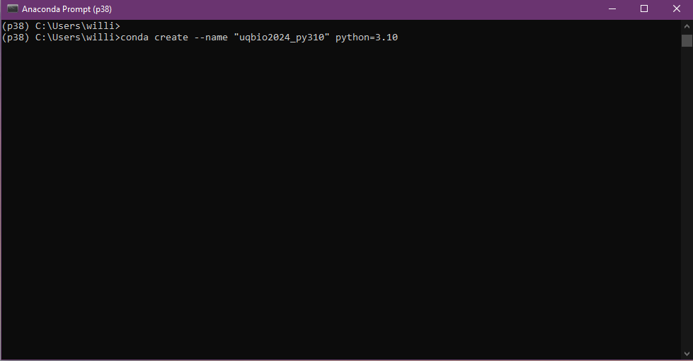
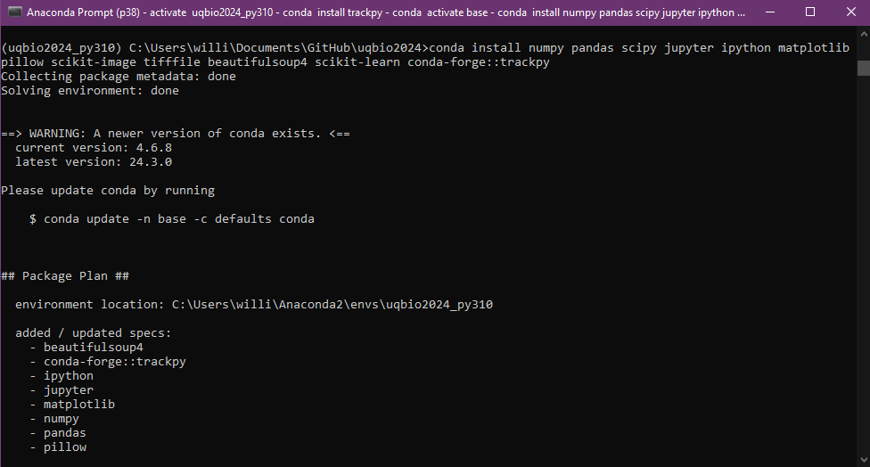
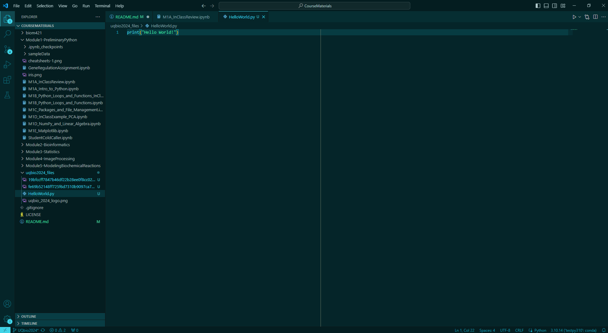
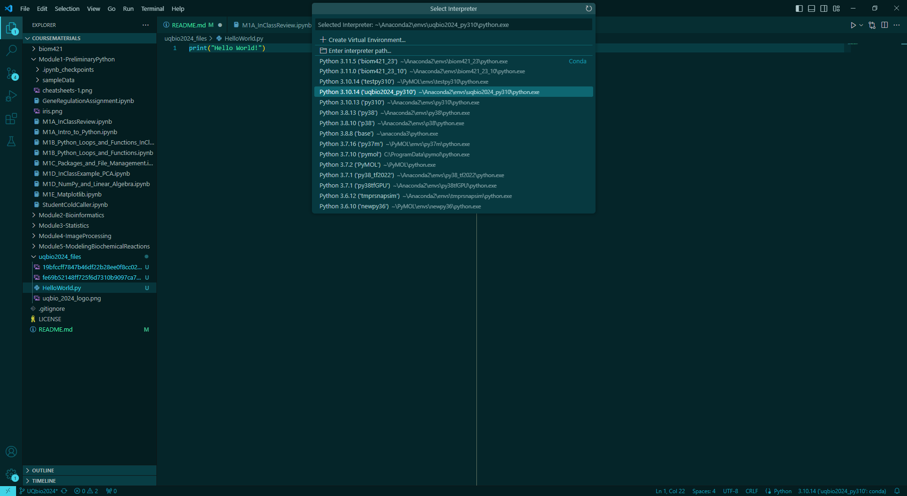

<html>
<h1> <left> Welcome to UQ-BIO Summer School 2024! </left> </h1>
        
         <div> <p></p> </div>
         <div style="font-size: 20px; width: 1000px;">
              <p><left==========================================left> </p>
              <p> Below is the GitHub repository holding all the links to Jupyter Notebooks and files needed during the course and instructions on installing Python.</p>
           <h3> Authors: </h3> 
           <pre> 
Brian Munsky, Luis Aguilera,
William Raymond, Joshua Cook, Michael May,
Zachary Fox, and Eric Ron.
           </pre>
<p><a href = "mailto: uqbio.summer.school@gmail.com"> uqbio.summer.school@gmail.com </a> • <a href="https://q-bio.org/wp/uq-bio-schedule-2024/">2024 Undergraduate Summer School Schedule</a>  • <a href="https://q-bio.org/wp/">UQ-Bio</a> •  <a href="https://www.engr.colostate.edu/~munsky/">Munsky Group</a> </p>
</div>
</p>
</html>

*[Python Setup](#python-setup)

*[Installing Anaconda](#installing-anaconda-or-miniconda)

*[Creating an Environment](#creating-an-environment)

*[Using your new environment](#using-your-new-environment-in-vs-code)

*[More Python Learning Resources](#learning-python-resources)

*[Getting Started with GitHub](#getting-started-with-github)

## Python Setup 

### Installing Anaconda or Miniconda

First we need an environment manager! Using an environment manager is good practice when doing coding projects as it lets you setup seperated coding environments and kernels for different tasks. 

Download and install either anaconda or miniconda from:  https://www.anaconda.com/download. Anaconda includes more packages and features that come with it but is around 5 gigabytes to install. Miniconda installs just the bare necessities and is 400 mb. For our purposes either works.

### Creating an Environment

Once you have conda installed, we need to create a new environment for the class. 

* Restart your computer so conda is available.
* Open up a new Terminal (Linux/Mac) or Anaconda Prompt / Command Prompt (Windows) and type the following commands
   1. ```conda activate```  - after activating you will see (base) in front of your prompt, this is the current conda environment you are in. 

   2. ```conda create --name "uqbio2024_py310" python=3.10``` 
   

   3. ```conda activate uqbio2024_py310```
    you should see your current environment switch to (uqbio2024_py310)

   4. ```conda install numpy pandas scipy jupyter ipython matplotlib pillow scikit-image tifffile beautifulsoup4 scikit-learn```
   
      * Note this command will take a while and will ask for your confirmation!

   5. ```pip install biopython```
   

   6. ```ipython``` then ```import numpy; import scipy; import skimage; import Bio; import matplotlib; import pandas; import tifffile;``` If this gives no errors your environment installed correctly and you are ready for the course!


### Using your new environment in VS Code

Now that we have a brand new environment, we can use an IDE (integrated developing environment) to use this Python environment for Python coding. For this course we recommend VS Code: https://code.visualstudio.com/

1. Open VS Code

   * Optional: Make a new workspace under File > Workspace to your CourseMaterials folder

2. Enter the search bar and type ">" or use "Ctrl + Shift + P" for activating the command pallette


3. type Python: Select interpreter and select the uqbio2024_py310 kernel


5. At the top, click Terminal and then New terminal or use "Ctrl + Shift + `"


6. Check that the terminal that popped up is using our correct environment by typing the following:
   * ```ipython```
   * ```import numpy; import scipy; import skimage; import Bio; import matplotlib; import pandas; import tifffile;```


If all these packages import with no errors then your environment is intact and ready to use for the course! Feel free to check out the preliminary python notebooks under CourseMaterials/Module1-PreliminaryPython/. To run a notebook file in VS Code, simply open the .ipynb file in VS code by navigating to it in your workspace or File > Open File.

### Learning Python resources

Python 3.10 documentation's tutorial: https://docs.python.org/3.10/tutorial/index.html


## Getting Started with GitHub

### Signing up for an Account

### Cloning your first repository

### Committing and Pushing Changes

### Resolving Conflicts

### Reverting Changes

### Using the GitHub Desktop Client

### Using GitHub in the VS Code IDE

## Licensing

[](https://opensource.org/licenses/BSD-3-Clause)
